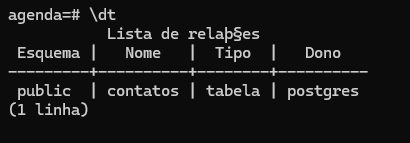
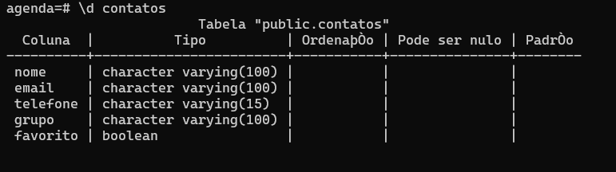
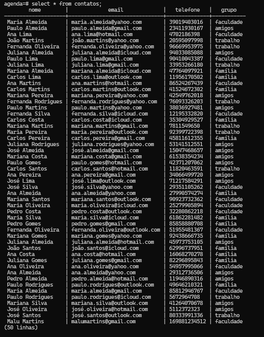

<h1>Banco de dados para Agenda de Contatos</h1>

<h2>Proposta da atividade:</h2>
<p>Criar uma agenda que permita ao usuário salvar os dados de seus contatos. Os dados desejados são:</p>
<ul>
    <li>Nome</li>
    <li>Email</li>
    <li>Telefone</li>
    <li>Grupo</li>
</ul>

<ol>
  <li>Inserir dados: inserir diversos contatos (No mínimo 50).</li>
  <li>Fazer buscas: escrever algumas buscas com diferentes filtros</li>
  <li>Atualizar registros: atualizar algumas informações de alguns contatos (No mínimo 10)</li>
  <li>Apagar contato: remover alguns contatos.</li>
  <li>Incluir a opção de favorito: incluir na tabela de contatos um campo para determinar se o contato em questão é ou 
não um contato favorito. </li>
</ol>

<hr>

<h2>Esquema</h2>

<b>Tabela:</b>
<br>

<br><br>
<b>Descrição da tabela:</b>
<br>

<br><br>
<b>Registros:</b>
<br>


<hr>

<h2>Extra: automações</h2>
<p>Desenvolvi um script em Python para gerar dados de teste de forma aleatória e automática e, após isso, realizar o insert na tabela do BD usando a biblioteca <b>Psycopg2</b> para fazer a conexão com o PostgreSQL.</p>
<p>O script pode ser encontrado em ```script.py```</p>